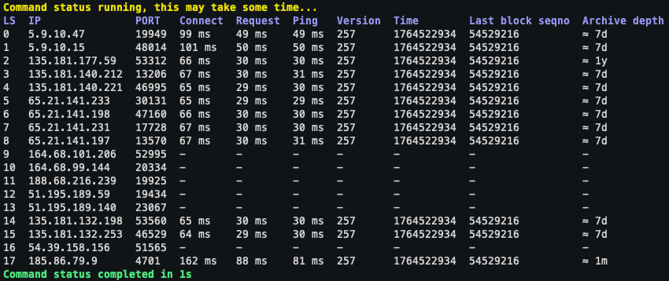

# 📦 Tonutils ADNL CTL

[](https://ton.org)

[](https://pypi.python.org/pypi/tonutils-adnlctl)
[](LICENSE)

**Tonutils ADNL CTL** is a minimal CLI utility for inspecting TON lite-server clients.



## Installation

```bash
pip install tonutils-adnlctl
```

## Usage

**Mainnet**

```commandline
tonutils-adnlctl status -n mainnet
```

**Testnet**

```commandline
tonutils-adnlctl status -n testnet
```

**From config**

```commandline
tonutils-adnlctl status -n mainnet -c /path/to/config.json
tonutils-adnlctl status -n mainnet -c https://example.com/config.json
```

## License

This repository is distributed under the [MIT License](LICENSE).
